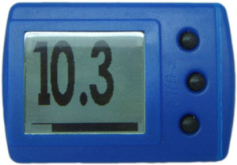
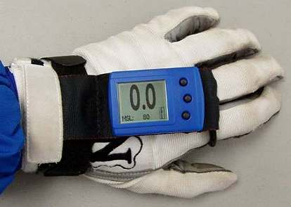

Description
-----------

These utilities were developed to read the jump data stored in the Altimaster Neptune Skydiving Altimeter by Alti-2, and dump the data in formats convenient for spreadsheet use or direct graphing in gnuplot.

I developed them, after reverse engineering my altimeter, to provide much more flexible data analysis than the original software from Alti-2 allows.

These were developed on the Linux operating system and compiled with gcc.  Apart from an IrDA infrared USB interface needed to talk to the altimeter, nothing special is needed.  The compiled utilities are checked into the repository.  To build it yourself, install the 'build-essential' package on your system and run 'make' against the included Makefile.

I've included sample jump data captured from my altimeter for a tandem jump I did in Perris Valley.

Alti-2 has discontinued this model of altimeter and since I don't own any of the newer ones, I have no idea if these utilities work on the newer altimeters or not.  Perhaps someone out there can try it out and add changes as appropriate.

Remember: Those who don't jump will never fly. (LEENA AHMAD ALMASHAT)

License
-------
Alti2Neptune Utilities
Copyright(c)2004 Donna Whisnant
Contact: <http://www.dewtronics.com/>

GNU General Public License Usage
This file may be used under the terms of the GNU General Public License
version 2.0 as published by the Free Software Foundation and appearing
in the file gpl-2.0.txt included in the packaging of this file. Please
review the following information to ensure the GNU General Public License
version 2.0 requirements will be met:
http://www.gnu.org/copyleft/gpl.html.

Other Usage
Alternatively, this file may be used in accordance with the terms and
conditions contained in a signed written agreement between you and
Donna Whisnant.

See '[gpl-2.0.txt](./gpl-2.0.txt)' for the full content of the license.
